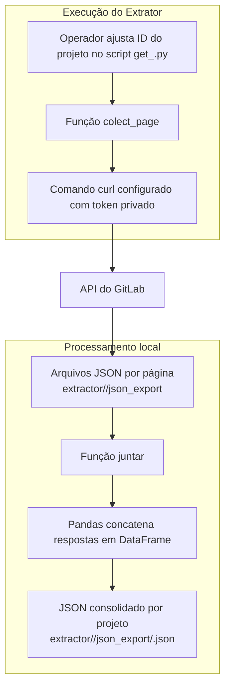

# Diagrama de Arquitetura

O diagrama abaixo resume o fluxo interno da aplicação **Neo GitLab Extractor**, destacando como os dados são coletados da API do GitLab e transformados em arquivos JSON consolidados.

Principais componentes destacados:

- **Scripts `get_.py` por projeto**: garantem a criação das pastas de saída, montam o comando `curl` com o token privado e realizam chamadas paginadas à API do GitLab para obter issues com peso definido.【F:extractor/10152778/get_.py†L1-L25】
- **Processamento com Pandas**: os arquivos JSON paginados são lidos e concatenados em um único DataFrame antes de serem exportados novamente como JSON consolidado por projeto.【F:extractor/10152778/get_.py†L26-L41】
